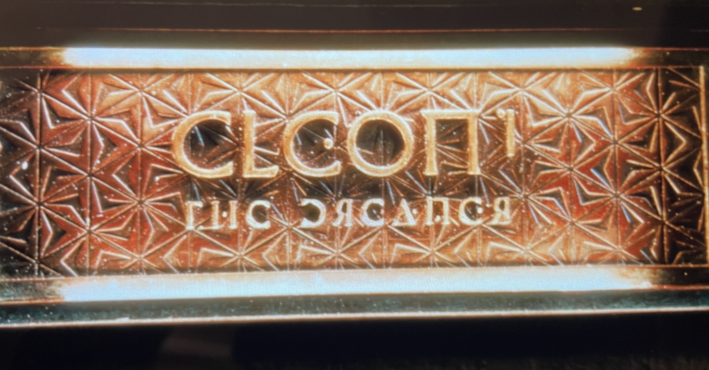
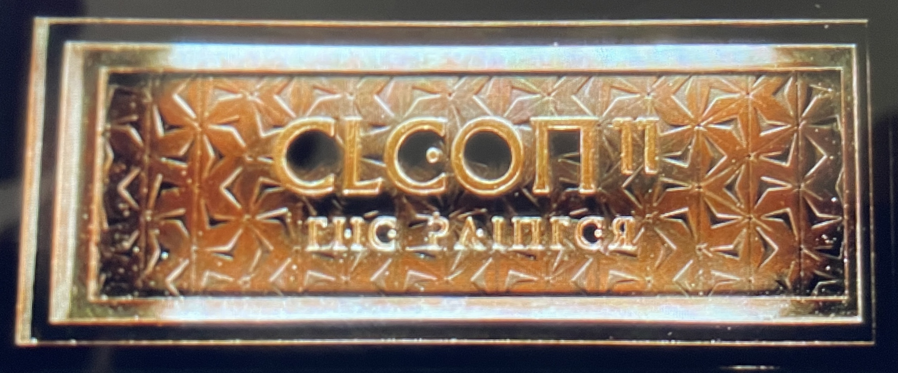

# Foundation Serif

A serif version of the main type design in Foundation, the Apple TV+ series based on the Isaac Asimov books.

Only one scene so far in Season One has shown a serifed Foundation font, when Cleon the 11th went to the memorial hall for his dynastic predecessors.

This is one in a series of related fonts based on type designs used on Foundation, including <a href="https://github.com/rsperberg/foundation-logo" title="Jump to Foundation Logo repo">Foundation Logo</a>, <a href="https://github.com/rsperberg/foundation-titles-hand" title="Jump to Foundation Titles repo">Foundation Titles</a>, <a href="https://github.com/rsperberg/foundation-one" title="Jump to Foundation One repo">Foundation One</a> and the not-yet-begun <a href="https://github.com/rsperberg/foundation-screen" title="Jump to Foundation Screen repo">Foundation Screen</a>.  All use the SIL Open Font License and are hosted here on GitHub.
